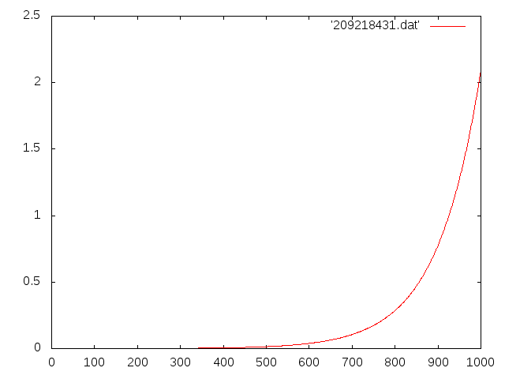
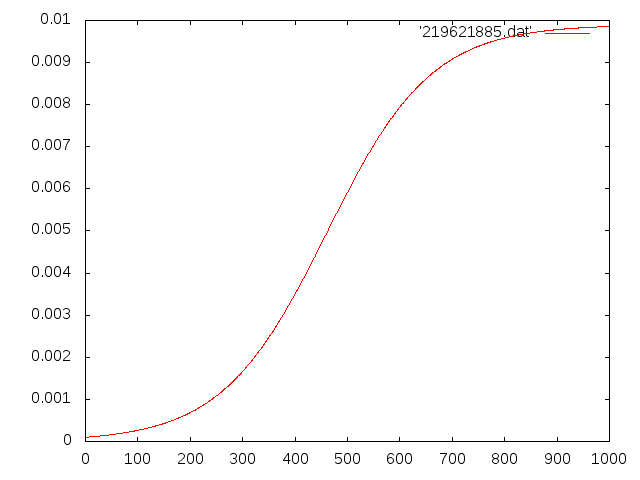

# Logistic Map

The logistic map is a polynomial mapping (equivalently, recurrence relation) of degree 2, often cited as an archetypal example of how complex, chaotic behaviour can arise from very simple non-linear dynamical equations. The map was popularized in a 1976 paper by the biologist Robert May, in part as a discrete-time demographic model analogous to the logistic equation first created by Pierre François Verhulst. [More](https://en.wikipedia.org/wiki/Logistic_map)

In this example we start with a simple (and non-real) model for bacteria growth using a linear map and then
apply some changes to come with a logistic map.

## Linear Map - grows indefinitely

## Logistic Map - after 900s the system finds a point of equilibrium

