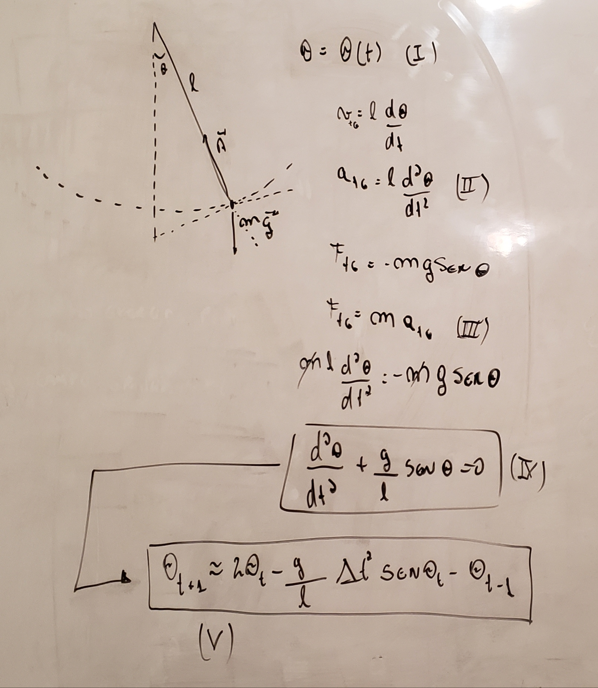
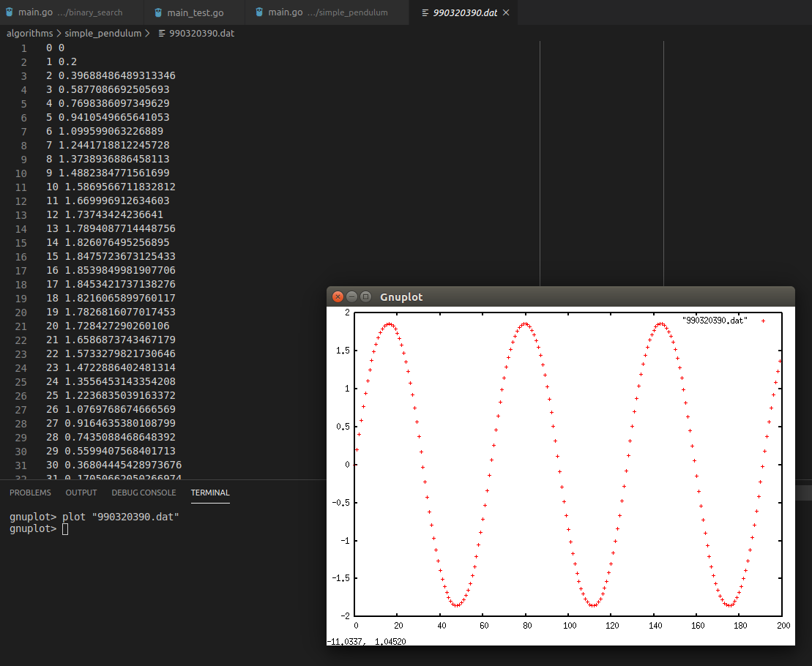

# Numerical Solution for the Simple Pendulum

This code is a simple implementation of the numerical solution for the Simple
Pendulum in Go.

In this [classic example](https://en.wikipedia.org/wiki/Pendulum_(mathematics)#Simple_gravity_pendulum), we are interested in to describe the position of the 
angle theta as a function of the time t. For that, we are considering the 
equilibrium of the system and directly applying Newton's second law (II -> III)
to find a second-order differential equation (IV). To solve this equation means to find
what is the function theta of t which the second derivative satisfies this equality.

As this problem has no analytical solution what we are doing is to [discretize (IV)](https://en.wikipedia.org/wiki/Numerical_methods_for_ordinary_differential_equations#Numerical_solutions_to_second-order_one-dimensional_boundary_value_problems)
to get a more computationally approachable form. (V) is often referred as an 
iterative map that can be then implemented using your programming language of choice.

Other details, such as the initial conditions for this problem, are in the code.

In the image below we can see a sample of the results as well as a graph view of
how theta (vertical axis) behaviors with t (horizontal axis).

