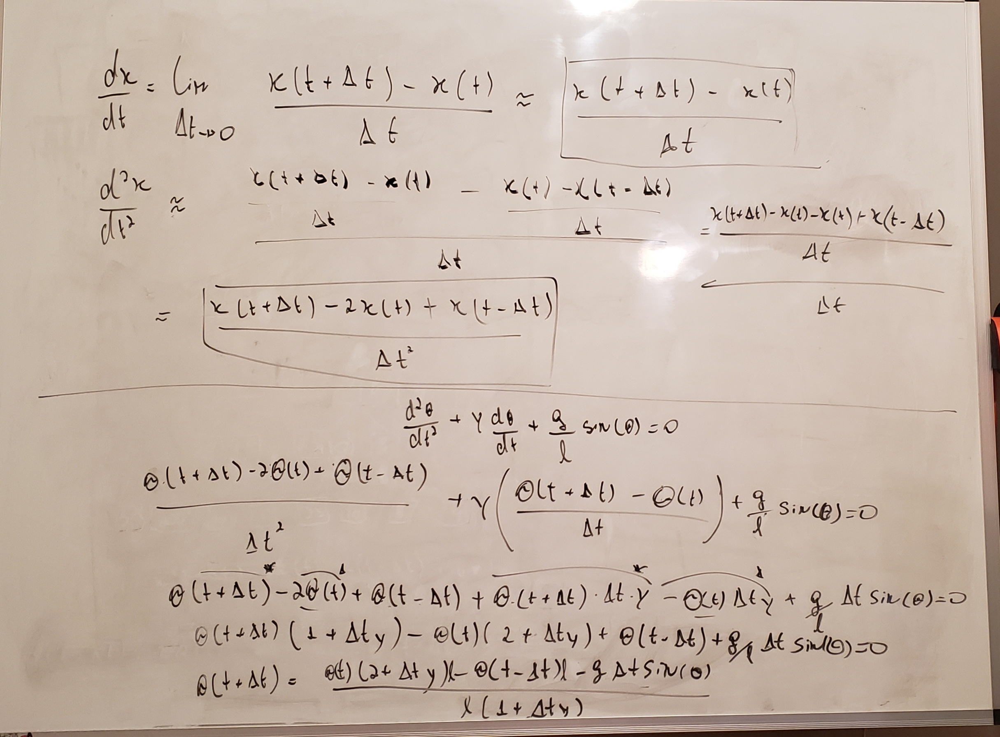
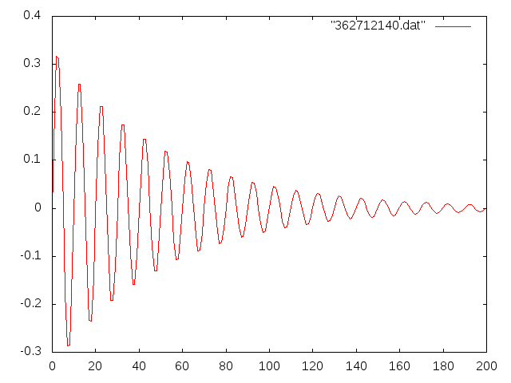

# Numerical Solution for the Simple Pendulum with Friction

This is a similar modeling as we did for the [non-friction](../no_friction/README.md) case
but here we take into consideration the air viscosity.

While in the [non-friction case](../no_friction/README.md) you can see a draft of the
physical modeling, here I'm gonna share the discretization approach for the
first and second derivatives.

Sorry this whiteboard is a mess :(



```bash
gnuplot> plot "362712140.dat" with line
gnuplot> set term png
Terminal type set to 'png'
Options are 'nocrop font "/usr/share/fonts/truetype/liberation/LiberationSans-Regular.ttf,12" fontscale 1.0 size 640,480 '
gnuplot> set output "result.png"
gnuplot> replot
gnuplot> set term x11
Terminal type set to 'x11'
Options are ' nopersist'
```



Even though the results look consistent I have a feeling that there might be an
error in the discretization steps. If you find it please let me know at 
[@soeiro_santos](https://twitter.com/soeiro_santos)